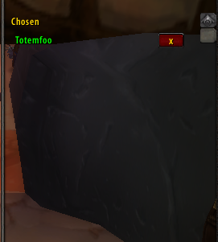

Ssssh.. use /goy for secret roll window

1:1 with [RollFor](https://github.com/sica42/RollFor) — identical in every way, with one addition: a hidden "Chosen" window only you can see. Add raid members to the Chosen list and only they can win `/rr` rolls. The public sees a real server roll, a real candidate list, and a matching winner. Nothing looks different.

